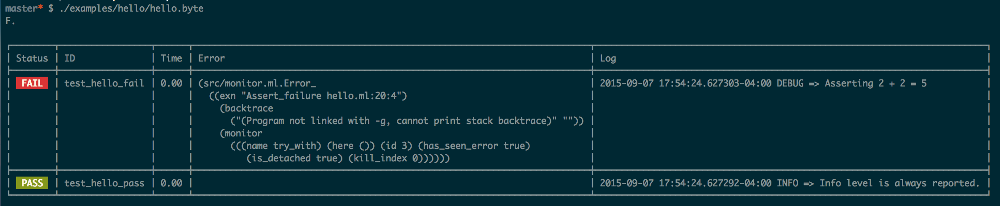

caravan
=======

A framework for (black-box) testing arbitrary systems, in OCaml. Inspired by
Erlang/OTP's ["Common Test"][].

["Common Test"]: http://www.erlang.org/doc/apps/common_test/basics_chapter.html

Example
-------

From [examples/hello](examples/hello)

```ocaml
let test_hello_pass =
  let case state ~log =
    Log.info  log "Info level is always reported.";
    Log.debug log "Asserting 2 + 2 = 4";
    assert (2 + 2 = 4);
    return state
  in
  {Test.id = "test_hello_pass"; case; children = []}

let test_hello_fail =
  let case state ~log =
    Log.debug log "Asserting 2 + 2 = 5";
    assert (2 + 2 = 5);
    return state
  in
  {Test.id = "test_hello_fail"; case; children = []}

let main () =
  let tests =
    [ test_hello_pass
    ; test_hello_fail
    ]
  in
  Caravan.run ~tests ~init_state:()
```


